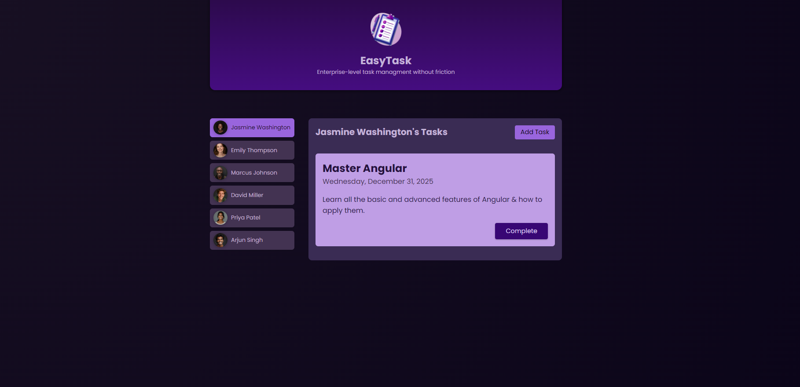

# Essentials

This project was generated with [Angular CLI](https://github.com/angular/angular-cli) version 17.1.2.

# Main View

## Development server

Run `npm start` for a dev server. Navigate to `http://localhost:4200/`. The application will automatically reload if you change any of the source files.

## Code scaffolding

Run `ng generate component component-name` to generate a new component. You can also use `ng generate directive|pipe|service|class|guard|interface|enum|module`.

## Build

Run `ng build` to build the project. The build artifacts will be stored in the `dist/` directory.

## Running unit tests

Run `ng test` to execute the unit tests via [Karma](https://karma-runner.github.io).

## Running end-to-end tests

Run `ng e2e` to execute the end-to-end tests via a platform of your choice. To use this command, you need to first add a package that implements end-to-end testing capabilities.

## Further help

To get more help on the Angular CLI use `ng help` or go check out the [Angular CLI Overview and Command Reference](https://angular.io/cli) page.
📝 Task Management List - My First Angular Project 📝
This is the frontend part of the Task Management List application, built as part of my journey learning Angular, following Maximilian Schwarzmüller's course. The project is a simple, interactive task management tool, allowing users to add, delete, and manage their tasks in an intuitive way.

  

 Table of contents 📝

<ol> <li><a href="#about-the-project-📁">About the project</a></li> <li><a href="#deploy-🚀">Deploy</a></li> <li><a href="#stack">Stack</a></li> <li><a href="#local-installation-option">Clone</a></li> <li><a href="#views-⚒">Views</a></li> <li><a href="#future-functionalities">Future functionalities</a></li> <li><a href="#contributions">Contribution</a></li> <li><a href="#web-refferences">Web refferences</a></li> <li><a href="#development">Development</a></li> <li><a href="#appreciations">Appreciation</a></li> <li><a href="#contact">Contact</a></li> </ol>
About the project 📁
This project is my first project using Angular, developed while following Maximilian Schwarzmüller’s Angular course. It focuses on mastering the basics of Angular by creating a simple task management application. The app allows users to manage their daily tasks and was built using Angular, TypeScript, and SCSS for styling.

Deploy 🚀

 <a href="https://yoanastamenova.github.io/Task-managment-list/"><strong> Click here! </strong></a>🚀🚀🚀 

Stack
Used technologies for the project:

    

Features
Task addition, deletion, and editing
Responsive design for both desktop and mobile views
Local installation option ⚙️
Clone the repository from the URL:

shell
Copy code
$ git clone https://github.com/yoanastamenova/Task-managment-list.git
Install the dependencies:

ruby
Copy code
$ npm install
Run the development server:

ruby
Copy code
$ ng serve
The app will be accessible at http://localhost:4200/.

Views
Main task list view

Task creation view

Future functionalities
  ✅ Add priority levels to tasks   ⬜ Implement due date reminders   ⬜ Add task categorization  
Contribute to the project 📦
Feel free to suggest improvements or new features.

There are two ways to contribute:

Opening an issue
Forking the repository, creating a new branch, and submitting a pull request:
shell
Copy code
$ git checkout -b feature/yourUsername-newFeature
$ git commit -m 'feat: add new feature'
$ git push origin feature/yourUsername-newFeature
Web refferences 📧
While learning and building this project, I referenced the following resources:

angular.io
Maximilian Schwarzmüller's Angular Course
Development 📌
js
Copy code
const developer = "yoanastamenova";

console.log("Developed by: " + developer);
Contact 📤
 

